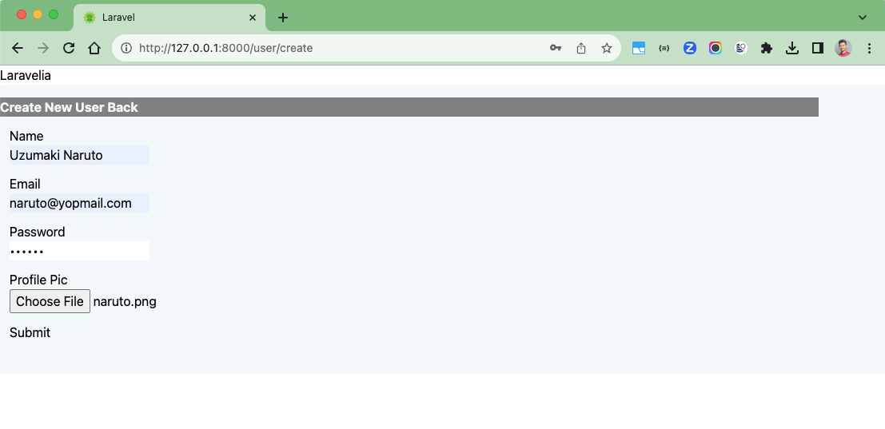
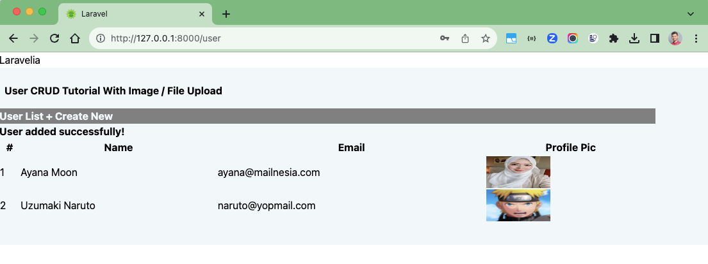

# Laravel 10 - Upload Photo

### Things todo list

1. Clone this repository: `git clone https://github.com/hendisantika/laravel-upload-photo2.git`
2. Navigate to the folder: `cd laravel-upload-photo2`
3. Run `composer install`
4. Run `cp .env.example .env`
5. Change with your DB credentials in your `.env` file
6. Run `php artisan key:generate`
7. Run `php artisan migrate`
8. Run `php artisan storage:link`
9. Run `php artisan serve`
10. Open your favorite browser: http://localhost:8000/user

### Image Screen shot

Add Image

List Images

